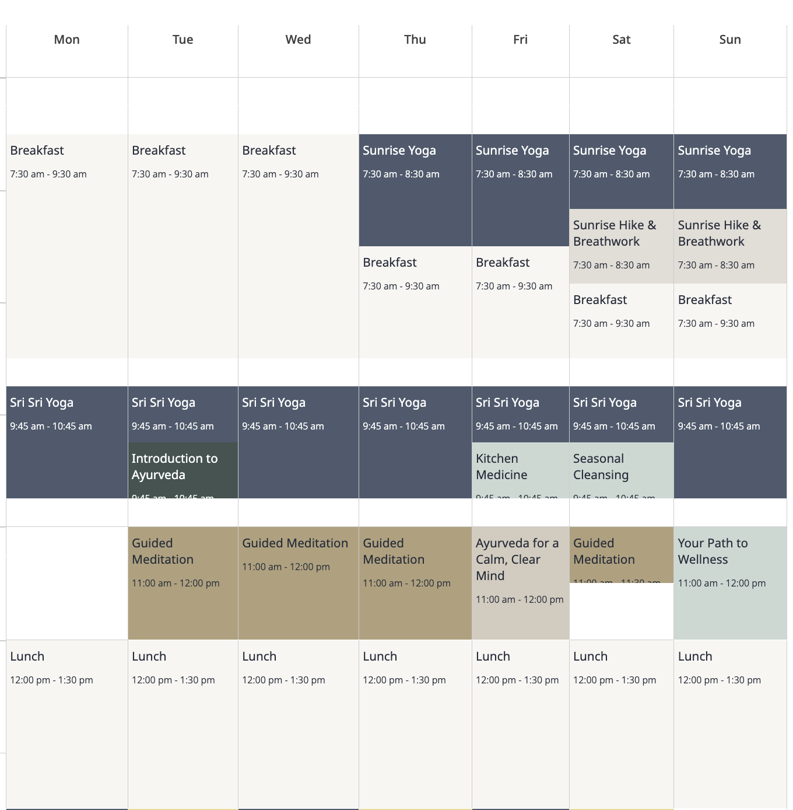
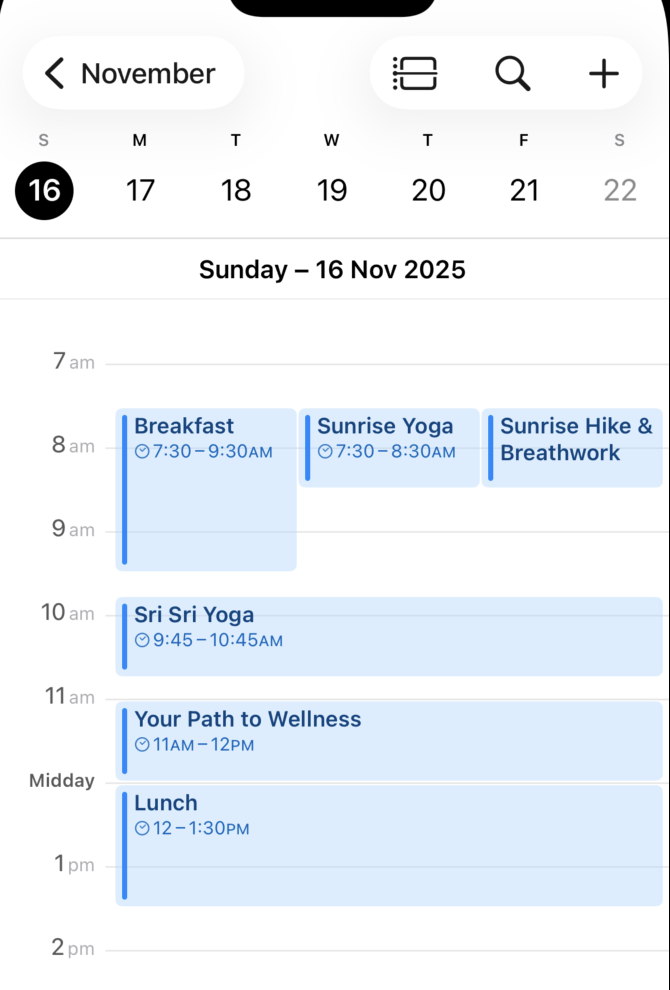

# Image2Calendar

An iOS SwiftUI application that uses OCR (Optical Character Recognition) to extract calendar events from images and automatically add them to your iOS Calendar.

## What It Does

Image2Calendar scans images of calendars—like screenshots or photos of weekly schedules—and automatically detects:
- Event titles
- Time ranges (start and end times)
- Days of the week
- Locations (when available)

The app then allows you to add these detected events to your iOS Calendar with a single tap, either individually or all at once.

## Screenshots

### Input: Calendar Image


The app processes images like this weekly schedule, extracting event titles, times, and days.

### Output: iOS Calendar


All detected events are automatically added to your iOS Calendar with the correct dates and times.

## Features

- **Smart OCR Processing**: Uses Apple's Vision framework for accurate text recognition
- **Spatial Analysis**: Intelligently maps events to day columns by analyzing text positions
- **Flexible Time Parsing**: Supports both 12-hour (e.g., "7:30 am - 9:30 am") and 24-hour (e.g., "13:00-14:00") time formats
- **Batch Operations**: Add all detected events to your calendar at once
- **Event Sorting**: Automatically sorts events by date and time
- **Native Calendar Integration**: Seamlessly integrates with iOS Calendar via EventKit

## Requirements

- **iOS 16.0+** (iOS 17+ recommended for full calendar access features)
- **Xcode 14.0+** for building
- **Swift 5.7+**
- **Calendar access permissions** (requested at runtime)

## Building and Installing

### Prerequisites

1. Install [Xcode](https://apps.apple.com/us/app/xcode/id497799835) from the Mac App Store
2. Clone or download this repository

### Build Steps

1. Open the project in Xcode:
   ```bash
   open Image2Calendar.xcodeproj
   ```

2. Select your target device:
   - For testing on a simulator: Choose any iOS simulator from the device menu
   - For testing on a physical device: Connect your iPhone/iPad and select it from the device menu

3. Build and run:
   - Press `Cmd+R` to build and run
   - Or press `Cmd+B` to build only

### Installing on a Physical Device

1. Connect your iOS device to your Mac
2. In Xcode, select your device from the device menu
3. You may need to set up a development team:
   - Go to the project settings → Signing & Capabilities
   - Select your Apple ID under "Team"
4. Build and run the app (`Cmd+R`)

**Note**: For running on a physical device, you'll need a free Apple Developer account at minimum. Simply sign in with your Apple ID in Xcode preferences.

## How to Use

1. **Launch the app** on your iOS device
2. **Tap "Select Photo"** to choose an image containing a calendar or schedule
3. **Review detected events** in the list that appears
4. **Add events to your calendar**:
   - Tap "Add to Calendar" on individual events, or
   - Tap "Add All to Calendar" to add all detected events at once
5. **Grant calendar permissions** when prompted

### Tips for Best Results

- Use clear, high-contrast images of calendars
- Ensure text is readable and not blurry
- Works best with grid-style weekly calendars where days are in columns
- Events should include time ranges in format "H:MM am/pm - H:MM am/pm" or "HH:MM-HH:MM"

## Known Limitations

- Only parses events with explicit time ranges
- Assumes all events are in the upcoming week from today
- Does not support all-day events or multi-day events
- Day detection relies on spatial positioning and standard weekly layouts

## Reporting Issues

Found a bug or have a feature request? We'd love to hear from you!

### How to Create an Issue

1. Go to the [Issues page](https://github.com/YOUR_USERNAME/Image2Calendar/issues) (replace `YOUR_USERNAME` with your GitHub username)
2. Click the **"New Issue"** button
3. Choose an appropriate title that summarizes the issue
4. Provide details including:
   - **What happened**: Describe the bug or feature request
   - **Expected behavior**: What you expected to happen
   - **Steps to reproduce**: How to recreate the issue (for bugs)
   - **Screenshots**: If applicable, add screenshots showing the problem
   - **Device info**: iOS version, device model
   - **Sample image**: For OCR parsing issues, include the calendar image you were trying to process (if not private)

### Issue Labels

- `bug`: Something isn't working correctly
- `enhancement`: New feature or improvement request
- `documentation`: Improvements or additions to documentation
- `help wanted`: Extra attention needed
- `question`: Further information requested

## Contributing

Contributions are welcome! Feel free to submit pull requests or create issues for bugs and feature requests.

## License

[Add your license here]

## Acknowledgments

- Built with SwiftUI and Apple's Vision framework
- Uses EventKit for iOS Calendar integration
